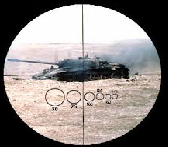
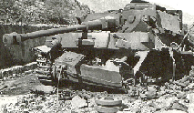

German Tank Problem Shiny app
========================================================
author: Risto
date: April 2015

German Tank Problem app
========================================================

You have to guess number of tanks produced size based on serial numbers of few tanks captured. All tanks have sequential serial number.

- For example you have captured 5 tanks with serial numbers 73, 5, 83, 49, 25. What is actual tank production?

- [Shiny application](https://ristohinno.shinyapps.io/GermanTankProblemApp/) provides and compares different solutions

-[Github repository](https://github.com/RRisto/GermanTankProblem)



Models for simulation
========================================================

- Change number of **tanks captured**, actual tank **production range** and **margin** for model 2 and compare how good different models are:

- **Model 1**, highest serial number captured = actual tank production

- **Model 2**, model 1 answer +(model 1 answer * margin) = actual tank production

- **Model 3**, formula originally used by allies: $$actual\ tank\ production = max + \frac{max}{n} - 1$$ (max - maximum serial number captured; n - number of tanks captured)

Compare different models (1)
========================================================

App simulates 10 guesses per model for each tank in actual chosen prodcution range. Accuracy of models is assessed by residuals:

 - residuals (as % difference from actual production) summary:


```
    Model        Mean    Median       Sd
1 Model 1 -16.2327080 -12.49809 14.12948
2 Model 2 -12.0443434  -8.12299 14.83595
3 Model 3  -0.2906281   4.19314 16.95818
```



Compare different models (2): residuals histogram
========================================================
 

<center><iframe scrolling='no' seamless='seamless' style='border:none' src='https://plot.ly/~risto.hinno/100//800/1200' width='800' height='500'></iframe><center>

Have a nice [tank hunt](https://ristohinno.shinyapps.io/GermanTankProblemApp/)!
